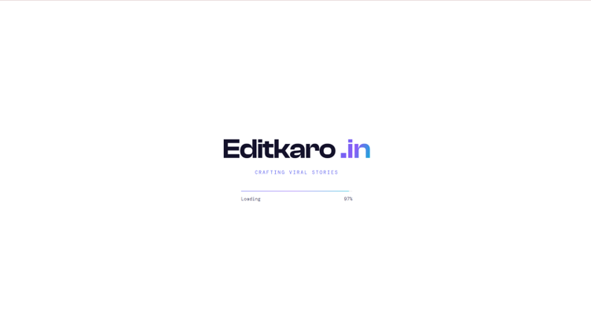

<div align="center">

<!-- ╔══════════════════════════════════════════════════════════════╗ -->
<!--                   ANIMATED WAVE HEADER                         -->
<!-- ╚══════════════════════════════════════════════════════════════╝ -->


<!-- ╔══════════════════════════════════════════════════════════════╗ -->
<!--                  ANIMATED TYPING TAGLINE                       -->
<!-- ╚══════════════════════════════════════════════════════════════╝ -->


<br/>

<!-- ╔══════════════════════════════════════════════════════════════╗ -->
<!--                      CTA BUTTONS                               -->
<!-- ╚══════════════════════════════════════════════════════════════╝ -->

[](https://aryan-sengar-portfolio-v2.netlify.app/)
[](#-getting-started)

<br/>

<!-- ╔══════════════════════════════════════════════════════════════╗ -->
<!--               ANIMATED SKILL / TECH ICON BADGES                -->
<!-- ╚══════════════════════════════════════════════════════════════╝ -->


<br/><br/>


</div>

<br/>

<!-- ━━━━━━━━━━━━━━━━━━━━━━━━━━━━ WAVE DIVIDER ━━━━━━━━━━━━━━━━━━━━━━━━━━━━ -->


<br/>

<!-- ╔══════════════════════════════════════════════════════════════╗ -->
<!--                      SITE PREVIEW                              -->
<!-- ╚══════════════════════════════════════════════════════════════╝ -->

<div align="center">

[](https://editkaro-v2.netlify.app/)

*Add a screenshot of the hero section at `assets_readme/hero.png` to populate this preview.*

</div>

<br/>

<!-- ━━━━━━━━━━━━━━━━━━━━━━━━━━━━ WAVE DIVIDER ━━━━━━━━━━━━━━━━━━━━━━━━━━━━ -->


<br/>

<!-- ╔══════════════════════════════════════════════════════════════╗ -->
<!--                     ABOUT THE PROJECT                          -->
<!-- ╚══════════════════════════════════════════════════════════════╝ -->

## 🎬 About The Project

**Editkaro.in** is a full production-ready website for a premium video editing and social media marketing agency, built with **React**, **Vite**, **Tailwind CSS**, **Framer Motion**, **GSAP**, and **Lenis** — designed and engineered to sit comfortably alongside Awwwards / Dribbble-grade creative studio sites rather than a templated agency landing page.

It ships with **8 fully-built pages**, a **custom magnetic cursor** with context-aware states, a **cinematic curtain preloader**, a **GSAP-pinned horizontal showreel**, a **filterable masonry portfolio** with a backdrop-blurred lightbox, and **Google Sheets-backed forms** for both the newsletter and contact flows — all wrapped in a strictly light, editorial visual language.

> 🧡 Built as a complete creative-studio deliverable: every button works, every page is real, and every animation runs at a 60fps target.

<br/>

<div align="center">

| 🎨 Design | ⚡ Animations | 🎥 Portfolio | 📬 Forms |
|:---:|:---:|:---:|:---:|
| Light theme, glassmorphism, gradient mesh | GSAP ScrollTrigger + Framer Motion + Lenis | 9 categories, filters, lightbox | Newsletter + Contact → Google Sheets |

</div>

<br/>

<!-- ━━━━━━━━━━━━━━━━━━━━━━━━━━━━ WAVE DIVIDER ━━━━━━━━━━━━━━━━━━━━━━━━━━━━ -->


<br/>

<!-- ╔══════════════════════════════════════════════════════════════╗ -->
<!--                        FEATURES                                -->
<!-- ╚══════════════════════════════════════════════════════════════╝ -->

## ✨ Features

<br/>

| 🎨 UI & Design | ⚙️ Functionality | 📱 UX & Motion |
|:---|:---|:---|
| Strict light theme — white, cream, glass surfaces | 10 service categories, fully interactive tilt cards | Custom magnetic cursor with 4 context-aware states |
| Indigo / violet / cyan gradient mesh + floating blobs | 18-project portfolio across 9 categories with live filtering | Cinematic curtain preloader with eased percentage counter |
| Clash Display + General Sans + DM Mono typography | Animated category switching with layout-aware reflow | GSAP-pinned horizontal showreel on the homepage |
| Glassmorphic cards, frosted nav, soft shadow system | Cinematic lightbox with backdrop blur + keyboard navigation | Lenis smooth scroll synced to GSAP ScrollTrigger |
| Gradient CTA buttons with magnetic hover pull | Newsletter capture with validation + success/error states | Scroll-linked stat counters (clients, projects, views, retention) |
| 3D tilt cards with glare-following pointer light | Contact form with name/email/phone/message validation | Blur-in split-text headline reveals |
| Animated mobile menu — full-screen takeover | Both forms post to Google Sheets via one shared Apps Script config | Scroll-progress bar + section reveal stagger |
| SEO-ready per-page meta, OG, Twitter cards, JSON-LD | Auto-sliding testimonial carousel with ratings | Reduced-motion support for accessibility |

<br/>

### 📌 Pages & Sections

```
Home  ·  Portfolio  ·  About  ·  Team  ·  Contact  ·  Privacy Policy  ·  Terms  ·  404
```

<br/>

<!-- ━━━━━━━━━━━━━━━━━━━━━━━━━━━━ WAVE DIVIDER ━━━━━━━━━━━━━━━━━━━━━━━━━━━━ -->


<br/>

<!-- ╔══════════════════════════════════════════════════════════════╗ -->
<!--                        TECH STACK                              -->
<!-- ╚══════════════════════════════════════════════════════════════╝ -->

## 🛠️ Tech Stack

<br/>

<div align="center">


<br/><br/>

| Layer | Technology | Purpose |
|:---:|:---|:---|
| ⚛️ **Framework** | [React 18](https://react.dev/) + [Vite 5](https://vitejs.dev/) | Component architecture, instant HMR, production bundling |
| 🧭 **Routing** | [React Router 6](https://reactrouter.com/) | Client-side routing across 8 pages with animated transitions |
| 🎨 **Styling** | [Tailwind CSS v3](https://tailwindcss.com/) | Utility-first responsive design, custom design tokens |
| 🎞️ **Animation** | [Framer Motion](https://www.framer.com/motion/) | Stagger reveals, blur-in text, magnetic buttons, layout transitions |
| 🌀 **Scroll FX** | [GSAP](https://gsap.com/) + ScrollTrigger | Pinned horizontal showreel, scroll-linked stat counters |
| 🛞 **Smooth Scroll** | [Lenis](https://github.com/darkroomengineering/lenis) | Eased scrolling synced to GSAP's ticker |
| 🖱️ **Cursor** | Custom React context + Framer Motion springs | Magnetic, context-aware cursor (explore / play / open / contact) |
| 🔤 **Icons** | [Lucide React](https://lucide.dev/) | Consistent line-icon system across the site |
| 🔍 **SEO** | [react-helmet-async](https://github.com/staylor/react-helmet-async) | Per-page title, meta, OG & Twitter tags |
| 📬 **Forms** | [Google Apps Script](https://developers.google.com/apps-script) | Newsletter + contact submissions piped into Google Sheets |
| 🔤 **Fonts** | [Fontshare](https://www.fontshare.com/) + [Google Fonts](https://fonts.google.com/) | Clash Display, General Sans, Inter, DM Mono |
| 💡 **Design Inspiration** | [React Bits](https://reactbits.dev/), Dribbble, Awwwards, 60fps.design | Interaction language & motion reference |

</div>

<br/>

<!-- ━━━━━━━━━━━━━━━━━━━━━━━━━━━━ WAVE DIVIDER ━━━━━━━━━━━━━━━━━━━━━━━━━━━━ -->


<br/>

<!-- ╔══════════════════════════════════════════════════════════════╗ -->
<!--                     PROJECT STRUCTURE                          -->
<!-- ╚══════════════════════════════════════════════════════════════╝ -->

## 📁 Project Structure

```
EditKaro.in-v2/
│
├── 📄 index.html                     ← Entry HTML, SEO meta, OG/Twitter tags, JSON-LD, fonts
├── 📦 package.json                   ← Dependencies & scripts
├── ⚙️  vite.config.js                ← Vite configuration
├── 🎨 tailwind.config.js             ← Brand colors, fonts, shadows, keyframes
├── 🤖 google-apps-script/Code.gs     ← Paste into Google Apps Script for form handling
├── 🔐 .env.example                   ← VITE_GOOGLE_SCRIPT_URL placeholder
│
├── 📂 public/
│   ├── 🖼️  favicon.svg               ← Custom monogram mark
│   ├── 🤖 robots.txt
│   └── 🗺️  sitemap.xml
│
└── 📂 src/
    ├── 🚀 main.jsx                   ← React entry point + BrowserRouter
    ├── 🧠 App.jsx                    ← Routes, cursor provider, preloader, Lenis
    ├── 🎨 index.css                  ← Global styles, glass utilities, gradient text
    │
    ├── 📂 data/
    │   ├── 📋 services.js            ← 10 service offerings
    │   ├── 🎬 portfolio.js           ← 18 projects across 9 categories
    │   ├── 👥 team.js                ← Team placeholder profiles
    │   └── 💬 testimonials.js        ← Client testimonials
    │
    ├── 📂 lib/
    │   ├── gsap.js                   ← Centralized GSAP + ScrollTrigger registration
    │   └── googleSheets.config.js    ← Shared submit handler for both forms
    │
    ├── 📂 hooks/
    │   ├── useLenis.js               ← Lenis ↔ GSAP ScrollTrigger sync
    │   └── useMagnetic.js            ← Magnetic hover-follow physics
    │
    ├── 📂 pages/                     ← Home, Portfolio, About, Team, Contact, Privacy, Terms, 404
    │
    └── 📂 components/
        ├── 🖱️  Cursor/               ← CursorContext + CustomCursor
        ├── ⏳ Preloader/             ← Cinematic curtain-reveal preloader
        ├── 🧭 Layout/                ← Navbar, Footer, Layout, SEO, PageTransition
        ├── 🧩 UI/                    ← MagneticButton, TiltCard, SectionHeading, AnimatedText…
        ├── 🏠 Home/                  ← Hero, Stats, Services, FeaturedWork, Testimonials, CTA
        ├── 🎬 Portfolio/             ← FilterBar, PortfolioCard, Lightbox
        ├── 📖 About/                 ← MissionVision, Timeline, Process
        ├── 👥 Team/                  ← TeamGrid
        └── 📬 Contact/               ← ContactForm
```

<br/>

<!-- ━━━━━━━━━━━━━━━━━━━━━━━━━━━━ WAVE DIVIDER ━━━━━━━━━━━━━━━━━━━━━━━━━━━━ -->


<br/>

<!-- ╔══════════════════════════════════════════════════════════════╗ -->
<!--                      GETTING STARTED                           -->
<!-- ╚══════════════════════════════════════════════════════════════╝ -->

## 🚀 Getting Started

**1. Clone the repository**

```bash
git clone https://github.com/aryansengar007/EditKaro.in-v2.git
```

**2. Navigate into the project folder**

```bash
cd EditKaro.in-v2
```

**3. Install dependencies**

```bash
npm install
```

**4. Start the development server**

```bash
npm run dev
```

**5. Build for production**

```bash
npm run build
```

> ✅ Runs on `http://localhost:5173` by default. Requires Node.js 18+.

**6. Wire up the forms (optional, for live submissions)**

```bash
cp .env.example .env
# paste your deployed Google Apps Script Web App URL into VITE_GOOGLE_SCRIPT_URL
```

Full Apps Script setup steps live in [`google-apps-script/Code.gs`](./google-apps-script/Code.gs) and inline comments in `src/lib/googleSheets.config.js`.

<br/>

<!-- ━━━━━━━━━━━━━━━━━━━━━━━━━━━━ WAVE DIVIDER ━━━━━━━━━━━━━━━━━━━━━━━━━━━━ -->


<br/>

<!-- ╔══════════════════════════════════════════════════════════════╗ -->
<!--                   DESIGN CHALLENGES                            -->
<!-- ╚══════════════════════════════════════════════════════════════╝ -->

## 🧩 Design Challenges & What I Learned

Several real bugs surfaced while building this — not a generic boilerplate, every one of these took real debugging:

| 🐛 Challenge | ✅ Resolution |
|:---|:---|
| Tailwind build failed with a circular `@apply` dependency on `.font-display` | The custom class shared its name with the `font-display` utility it was applying — switched to raw `font-family` CSS instead of `@apply` |
| Preloader curtain-slide animation never visually played | The wrapping `{!done && …}` conditional unmounted the whole tree in the same render the exit state flipped — decoupled the visual exit animation from the mount condition so curtains finish sliding before unmount |
| Overriding Tailwind's `indigo` / `violet` / `cyan` palette broke shade-suffixed classes | Audited every usage site for `-50`…`-900` suffixes before flattening these tokens to single brand hex values |
| GSAP horizontal showreel needed to pin without breaking on mobile | Scoped the pin/scrub ScrollTrigger to a `lg:` matchMedia check with a static fallback layout below that breakpoint |
| Lenis smooth scroll fighting GSAP ScrollTrigger's scroll position | Routed Lenis's `scroll` event into `ScrollTrigger.update` and drove Lenis from `gsap.ticker` so both stay perfectly in sync |
| Custom cursor flickering between a parent and its nested children | Used `event.relatedTarget.closest('[data-cursor]')` on `mouseout` to confirm the pointer actually left the tagged element before resetting state |
| Google Apps Script form POSTs blocked by CORS preflight | Switched to `mode: 'no-cors'` with a `text/plain` body — the trade-off is an opaque response, so success is inferred rather than confirmed client-side |

> 💡 **Key takeaway:** the hardest parts of a "premium" front-end aren't the animations themselves — they're the sequencing between state, mount/unmount timing, and the scroll libraries that all want to own the same scroll position.

<br/>

<!-- ━━━━━━━━━━━━━━━━━━━━━━━━━━━━ WAVE DIVIDER ━━━━━━━━━━━━━━━━━━━━━━━━━━━━ -->


<br/>

<!-- ╔══════════════════════════════════════════════════════════════╗ -->
<!--                    ACKNOWLEDGEMENTS                            -->
<!-- ╚══════════════════════════════════════════════════════════════╝ -->

## 🙌 Acknowledgements

- 🎞️ Motion direction inspired by [React Bits](https://reactbits.dev/), Dribbble, Awwwards, and 60fps.design
- 🌀 Scroll-linked animation via [GSAP](https://gsap.com/) & [ScrollTrigger](https://gsap.com/docs/v3/Plugins/ScrollTrigger/)
- 🛞 Smooth scrolling via [Lenis](https://github.com/darkroomengineering/lenis)
- 🎬 UI motion via [Framer Motion](https://www.framer.com/motion/)
- 🔤 Icons by [Lucide](https://lucide.dev/)
- 🔤 Typography via [Fontshare](https://www.fontshare.com/) (Clash Display, General Sans) & [Google Fonts](https://fonts.google.com/) (Inter, DM Mono)
- 📬 Form handling via [Google Apps Script](https://developers.google.com/apps-script)

<br/>

<!-- ╔══════════════════════════════════════════════════════════════╗ -->
<!--                     AUTHOR & CONNECT                           -->
<!-- ╚══════════════════════════════════════════════════════════════╝ -->

## 👨‍💻 Author

<div align="center">

### Aryan Sengar

🎓 **B.Tech CSE (AI & ML)** &nbsp;|&nbsp; 🌍 Gurugram, India &nbsp;|&nbsp; Frontend Developer & UI Enthusiast

<br/>

[](https://www.linkedin.com/in/aryan-sengar-786b96290/)
[](https://github.com/aryansengar007)
[](https://aryan-sengar-portfolio-v2.netlify.app/)
[](https://leetcode.com/u/aryan_sengar007/)

</div>

<br/>

<!-- ╔══════════════════════════════════════════════════════════════╗ -->
<!--                   ANIMATED WAVE FOOTER                         -->
<!-- ╚══════════════════════════════════════════════════════════════╝ -->


<div align="center">

© 2026 **Aryan Sengar** — All Rights Reserved. Unauthorized copying is strictly prohibited.

<br/>

*If you found this project helpful or inspiring, consider leaving a* ⭐ *— it means a lot!*

</div>
